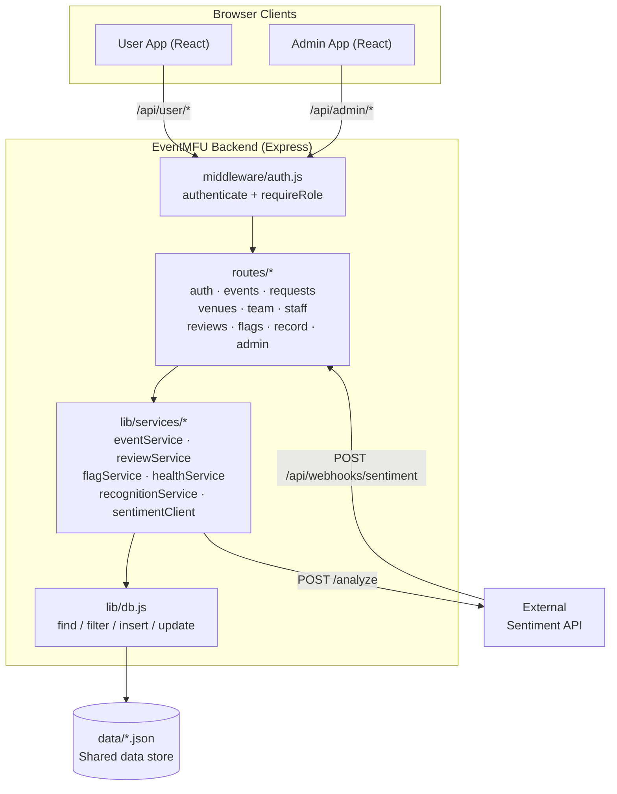

# Diagram 1 — System Architecture

**Type:** Component / deployment diagram
**Source:** `docs/APP_FLOW.md` §1, `docs/REQUIREMENTS_DESIGN.md` §1

---

## Overview

EventMFU is a monolithic web app: one Express backend serves both the User app and the Admin app through role-scoped API namespaces. There is no separate Creator app (collapsed into the User app in v11).

```
┌─────────────────────────────────────────────────────────────────────┐
│                         Browser clients                             │
│                                                                     │
│  ┌────────────────────────────┐   ┌──────────────────────────────┐  │
│  │        User App            │   │         Admin App            │  │
│  │  (React, Vite)             │   │  (React, Vite)               │  │
│  │                            │   │                              │  │
│  │  • Event feed & detail     │   │  • Request queue             │  │
│  │  • Booking + QR check-in   │   │  • Venue registry            │  │
│  │  • Event Request form      │   │  • Flag queues               │  │
│  │  • Manage view (if         │   │  • Direct event creation     │  │
│  │    EventOrganizer row      │   │  • Activity log              │  │
│  │    exists for the user)    │   │  • Platform settings         │  │
│  │  • Staff Openings          │   │                              │  │
│  │  • My Record               │   │                              │  │
│  └────────────┬───────────────┘   └──────────────┬───────────────┘  │
│               │ /api/user/*                       │ /api/admin/*     │
└───────────────┼───────────────────────────────────┼──────────────────┘
                │                                   │
                └──────────────┬────────────────────┘
                               │
          ┌────────────────────▼──────────────────────┐
          │         EventMFU Express Backend           │
          │           (backend/server.js)              │
          │                                            │
          │  middleware/auth.js                        │
          │  ├── authenticate()  — resolves session    │
          │  └── requireRole()  — user | admin guard   │
          │                                            │
          │  routes/                                   │
          │  ├── auth.js         (signup/verify/login) │
          │  ├── events.js       (CRUD, publish)       │
          │  ├── requests.js     (event request flow)  │
          │  ├── venues.js       (registry, assign)    │
          │  ├── team.js         (organizer/contrib)   │
          │  ├── staff.js        (calls, applications) │
          │  ├── reviews.js      (submit, sentiment)   │
          │  ├── flags.js        (organizer + health)  │
          │  ├── record.js       (recognition, record) │
          │  └── admin.js        (logs, settings)      │
          │                                            │
          │  lib/services/                             │
          │  ├── eventService.js                       │
          │  ├── reviewService.js + reviewPrivacy.js   │
          │  ├── flagService.js                        │
          │  ├── healthService.js                      │
          │  ├── recognitionService.js                 │
          │  └── sentimentClient.js  ──────────────────┼──► External sentiment API
          │                                            │◄── POST /api/webhooks/sentiment
          │  lib/db.js  (find / filter / insert / update)
          └────────────────────┬───────────────────────┘
                               │
          ┌────────────────────▼──────────────────────┐
          │         Shared data store                  │
          │  (backend/data/*.json — mock JSON files,   │
          │   one per entity collection)               │
          │                                            │
          │  users.json · events.json · venues.json    │
          │  event_requests.json · event_organizers.json│
          │  event_contributors.json · bookings.json   │
          │  reviews.json · questions.json             │
          │  staff_calls.json · applications.json      │
          │  health_transactions.json · flags.json     │
          │  points_transactions.json · activity_log.json│
          │  platform_settings.json                    │
          │                                            │
          │  Swap db.js for a real DB adapter later;  │
          │  services never touch files directly.      │
          └───────────────────────────────────────────┘
```

---

## Key architectural decisions

| Decision | Rationale |
|----------|-----------|
| Single backend, two apps | One source of truth; no sync mechanism between separate processes |
| Role-scoped API namespaces | `/api/user/*` vs `/api/admin/*`; role enforced at the middleware layer, not per-route |
| No Creator app | Organizer is event-scoped data (EventOrganizer row), not an account type; the User app shows a "Manage" view driven by data |
| db.js abstraction | All file/DB access goes through four helpers (find/filter/insert/update); replacing the mock store means only touching db.js |
| External sentiment only | `sentimentClient.js` is the sole call-out point; EventMFU never computes sentiment itself |
| Computed recognition | recognitionService reads existing tables live; no secondary ledger that can drift |

---

## Mermaid source


