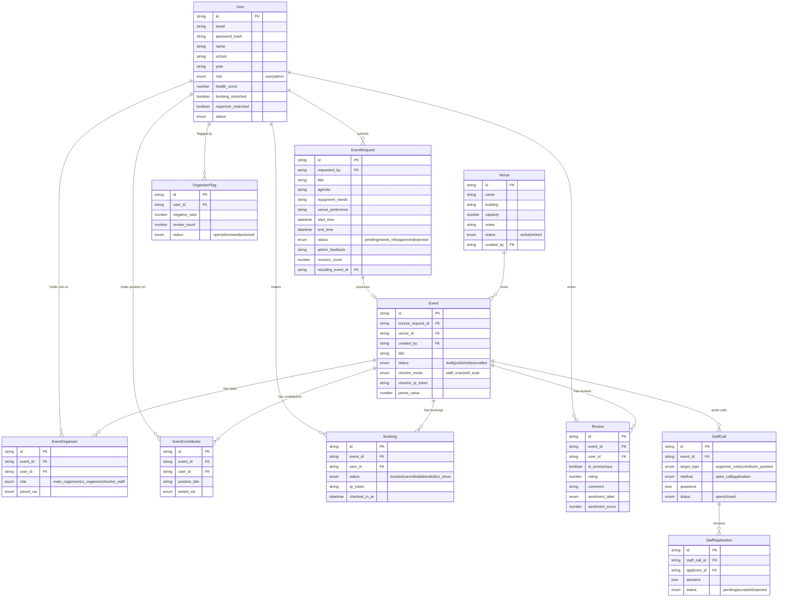

# Diagram 2 — Data Model (Entity-Relationship)

**Type:** ER diagram
**Source:** `docs/REQUIREMENTS_DESIGN.md` §10, `docs/DATA_MODEL.md`

---

## Entity relationship overview

```
                              ┌──────────────────┐
                              │      User         │
                              │──────────────────-│
                              │ id (PK)           │
                              │ email (verified)  │
                              │ password_hash     │
                              │ name, school, year│
                              │ role: user|admin  │
                              │ health_score      │
                              │ booking_restricted│
                              │ organizer_restricted
                              │ status            │
                              └──────┬────────────┘
                                     │
          ┌──────────────────────────┼────────────────────────────────────┐
          │                          │                                    │
          │ submits                  │ creates (admin only)               │ logs actions
          ▼                          ▼                                    ▼
┌──────────────────┐      ┌───────────────────┐               ┌─────────────────┐
│  EventRequest    │      │      Venue         │               │  ActivityLog    │
│──────────────────│      │───────────────────│               │─────────────────│
│ id               │      │ id                │               │ id              │
│ requested_by(FK) │      │ name, building    │               │ actor_id (FK)   │
│ title, description│     │ capacity, notes   │               │ action_type     │
│ agenda           │ approves+assigns │ status: active|retired│ target_type/id  │
│ equipment_needs  ├─────►│                   │               │ metadata        │
│ contact_phone    │      └────────┬──────────┘               │ created_at      │
│ venue_preference │               │ assigned to              └─────────────────┘
│ start/end_time   │               │
│ capacity, audience│              ▼
│ checkin_mode     │      ┌───────────────────┐
│ points_value     │      │      Event        │
│ status:          ├─────►│───────────────────│
│  pending|         creates│ id               │
│  needs_info|     │      │ source_request_id │◄── null for Admin-created
│  approved|       │      │  (FK, nullable)   │
│  rejected        │      │ venue_id (FK)     │
│ admin_feedback   │      │ created_by (FK)   │
│ revision_count   │      │ title, description│
│ resulting_event_id│     │ start/end_time    │
└──────────────────┘      │ capacity, audience│
                          │ checkin_mode      │
                          │ checkin_qr_token  │
                          │ points_value      │
                          │ status: draft|    │
                          │  published|cancelled
                          └──────┬────────────┘
                                 │
          ┌──────────────────────┼────────────────────────────────────┐
          │ has many             │ has many                           │ has many
          ▼                      ▼                                    ▼
┌─────────────────┐   ┌──────────────────┐               ┌─────────────────────┐
│ EventOrganizer  │   │ EventContributor │               │     Booking          │
│─────────────────│   │──────────────────│               │─────────────────────│
│ id              │   │ id               │               │ id                  │
│ event_id (FK)   │   │ event_id (FK)    │               │ event_id (FK)       │
│ user_id (FK)    │   │ user_id (FK)     │               │ user_id (FK)        │
│ role:           │   │ position_title   │               │ status: booked|     │
│  main_organizer │   │ joined_via       │               │  cancelled|attended │
│  co_organizer   │   │ assigned_by (FK) │               │  |no_show           │
│  checkin_staff  │   │ assigned_at      │               │ qr_token            │
│ joined_via      │   └──────────────────┘               │ booked_at           │
│ assigned_by (FK)│                                      │ cancelled_at        │
│ assigned_at     │           ┌────────────────────────► │ checked_in_at       │
└─────────────────┘           │                          └─────────────────────┘
                              │ created from                        │ generates
          ┌───────────────────┤                                     ▼
          │                   │                          ┌─────────────────────┐
          ▼                   │                          │     Review          │
┌──────────────────┐          │                          │─────────────────────│
│   StaffCall      │          │                          │ id                  │
│──────────────────│          │                          │ event_id (FK)       │
│ id               │          │                          │ user_id (FK)        │
│ event_id (FK)    │          │                          │ is_anonymous        │
│ target_type:     │          │                          │ rating (1–5)        │
│  organizer_role  │          │                          │ comment             │
│  contributor_pos │          │                          │ sentiment_label     │
│ organizer_role   │          │                          │ sentiment_score     │
│ position_title   │          │                          │ sentiment_status    │
│ method:          │          │                          └──────────────┬──────┘
│  open_call       │          │                                         │ triggers
│  application     │          │                                         ▼
│ slots_total/filled│         │                          ┌─────────────────────┐
│ questions[]      │          │                          │  OrganizerFlag      │
│ status: open|closed         │                          │─────────────────────│
└───────┬──────────┘          │                          │ user_id (FK)        │
        │ has many            │                          │ negative_ratio      │
        ▼                     │                          │ review_count        │
┌──────────────────┐          │                          │ status/resolution   │
│ StaffApplication │──────────┘                          └─────────────────────┘
│──────────────────│
│ id               │
│ staff_call_id(FK)│    ┌──────────────────────────────────────────────────────┐
│ applicant_id(FK) │    │  Health & Points ledgers (per User)                  │
│ answers[]        │    │                                                      │
│ status: pending| │    │  HealthTransaction: user_id, booking_id, delta, reason│
│  accepted|rejected    │  UserHealthFlag: user_id, health_score_at_flag, status│
│ reviewed_by (FK) │    │  PointsTransaction: user_id, event_id, booking_id,   │
└──────────────────┘    │    points, sync_status                               │
                        │                                                      │
                        │  PlatformSettings: key/value (admin-configurable)    │
                        └──────────────────────────────────────────────────────┘
```

---

## Mermaid source


