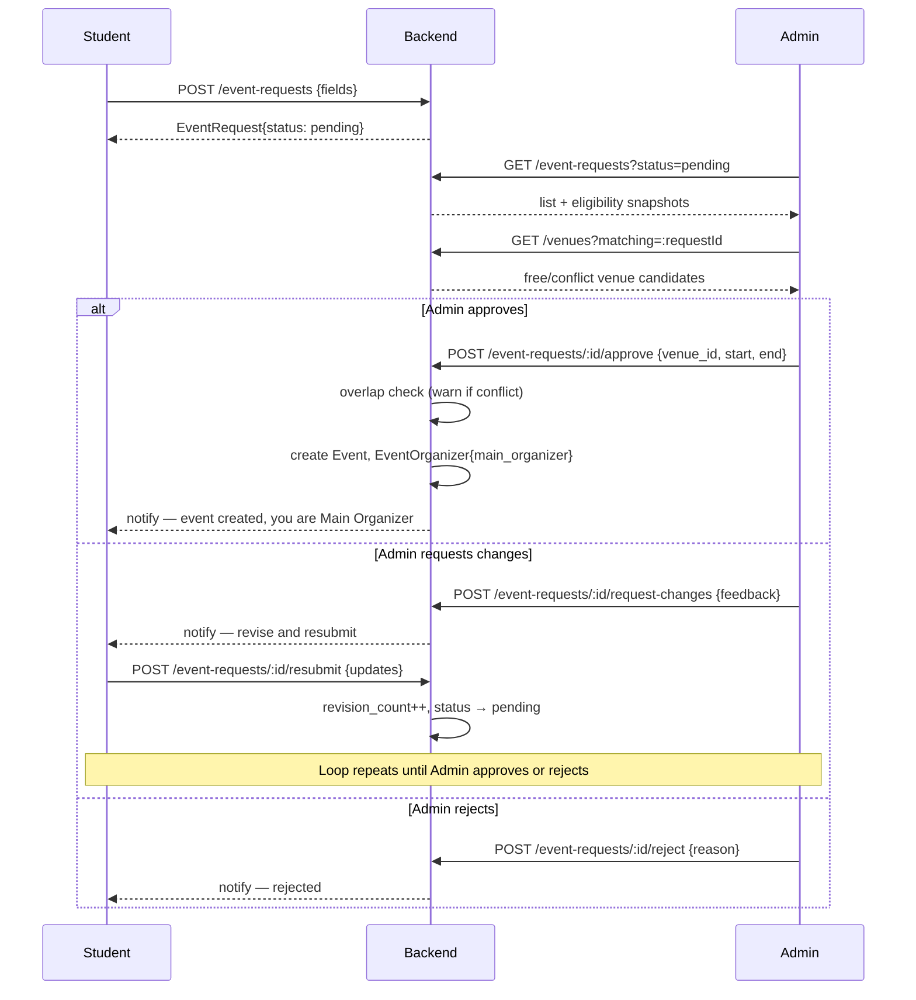

# Diagram 3 — Event Request Workflow

**Type:** Process / sequence diagram
**Source:** `docs/REQUIREMENTS_DESIGN.md` §3.3, §11; `docs/APP_FLOW.md` §3a

This is the primary path for a student to become an event organizer. It is also the main venue-coordination flow — Admin assigns the actual room.

---

## Flow diagram

```
Student (User app)                Backend                     Admin (Admin app)
        │                            │                               │
        │  POST /api/user/           │                               │
        │  event-requests            │                               │
        │  {title, description,      │                               │
        │   agenda,                  │                               │
        │   equipment_needs,         │                               │
        │   contact_phone,           │                               │
        │   venue_preference,        │                               │
        │   start_time, end_time,    │                               │
        │   capacity, audience_type, │                               │
        │   checkin_mode,            │                               │
        │   points_value}            │                               │
        │───────────────────────────►│                               │
        │                            │  EventRequest{status:pending} │
        │  status: pending           │                               │
        │◄───────────────────────────│                               │
        │                            │                               │
        │                            │  GET /api/admin/              │
        │                            │  event-requests?status=pending│
        │                            │◄──────────────────────────────│
        │                            │  per row: eligibility snapshot│
        │                            │  (organizer_restricted,       │
        │                            │   health_score,               │
        │                            │   prior organizing + flags)   │
        │                            │───────────────────────────────►
        │                            │                               │
        │                            │  GET /api/admin/              │
        │                            │  venues?matching=:requestId   │
        │                            │◄──────────────────────────────│
        │                            │  registry venues matching     │
        │                            │  venue_preference, each flagged│
        │                            │  free/conflict for start/end  │
        │                            │───────────────────────────────►
        │                            │                               │
        │                            │               ┌───────────────┴────────────────┐
        │                            │               │      Admin chooses an outcome   │
        │                            │               └──┬────────────────┬─────────────┘
        │                            │                  │                │
        │          ┌─────────────────┤ APPROVE          │ REQUEST CHANGES│ REJECT
        │          │                 │                  │                │
        │          │  POST /approve  │◄─────────────────┘                │
        │          │  {venue_id,     │                                   │
        │          │   start, end}   │                                   │
        │          │                 │  overlap check                    │
        │          │                 │  (409 if conflict; force:true     │
        │          │                 │   to proceed anyway)              │
        │          │                 │                                   │
        │          │      ┌──────────┤  ● Event{status:draft,           │
        │          │      │          │    venue_id: set,                 │
        │          │      │          │    start/end: confirmed}          │
        │          │      │          │  ● EventOrganizer{main_organizer, │
        │          │      │          │    joined_via:event_request_approval}
        │          │      │          │  ● EventRequest.status → approved │
        │          │      │          │                                   │
        │  notified│      │          │        POST /request-changes      │
        │  + event │      │          │        {feedback}◄────────────────┘
        │  created │      │          │                                   │ POST /reject
        │          │      │          │  EventRequest.status → needs_info │ {reason}
        │          │      │          │  admin_feedback: <set>            │◄────────────
        │          │      │          │                                   │
        │          │      │  notify  │                                   │
        │◄─────────┘      │◄─────────│  "revise and resubmit"            │
        │                 │          │                                   │
        │  POST /api/user/│          │                                   │
        │  event-requests/│          │                                   │
        │  :id/resubmit   │          │                                   │
        │  {...updates}   │          │                                   │
        │────────────────►│          │                                   │
        │                 │  EventRequest.revision_count += 1            │
        │                 │  status → pending  (re-enters queue above)   │
        │                 │          │                                   │
        │                 │          │                          notify   │
        │◄────────────────┘ notify   │  rejected ────────────────────────►
        │  approved: event│          │                                   │
        │  ready to publish          │                                   │
```

---

## State machine: EventRequest.status

```
                    submit
  [not created] ──────────────► [pending]
                                    │
                    ┌───────────────┼────────────────┐
                    │               │                │
               Admin rejects   Admin sends      Admin approves
                    │           for changes          │
                    ▼               │                ▼
               [rejected]           ▼           [approved]
                              [needs_info]    (→ Event created)
                                    │
                              requester
                              resubmits
                                    │
                                    ▼
                               [pending]  ──── (loops until Admin decides)
```

---

## Mermaid sequence diagram


