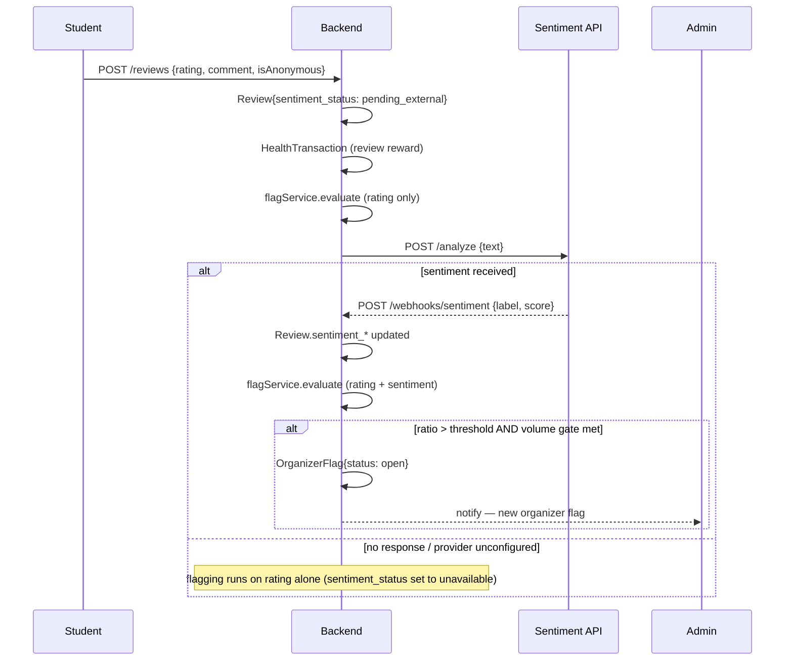

# Diagram 4 — Check-In, Post-Event Sweep & Review Flow

**Type:** Sequence / lifecycle diagram
**Source:** `docs/REQUIREMENTS_DESIGN.md` §6, §7, §8; `docs/APP_FLOW.md` §5

This diagram covers the entire lifecycle of a booking from check-in day through the review and quality-signal pipeline.

---

## Full lifecycle diagram

```
Student (User app)       Organizer / Staff app     Backend                  External sentiment
        │                         │                    │                           │
        │                         │  EVENT DAY         │                           │
        │                         │                    │                           │
  ─── Staff-scan mode ────────────────────────────────────────────────────────────│
        │                         │                    │                           │
        │  shows Booking QR       │                    │                           │
        │ ────────────────────────►                    │                           │
        │                         │  POST /checkin/scan│                           │
        │                         │  {qrToken}─────────►                           │
        │                         │                    │  verify: within window?  │
        │                         │                    │  Booking{status:booked}? │
        │                         │                    │  → Booking{status:attended,
        │                         │                    │     checked_in_at: now}  │
        │                         │◄────── confirmed ──│                           │
        │                         │                    │                           │
  ─── Self-scan mode ─────────────────────────────────────────────────────────────│
        │                         │                    │                           │
        │  scans Event.checkin_qr_token (venue poster) │                           │
        │  POST /checkin/self {venueToken}             │                           │
        │──────────────────────────────────────────────►                           │
        │                         │                    │  verify:                 │
        │                         │                    │  venueToken matches event?│
        │                         │                    │  session user has booking?│
        │                         │                    │  within window?           │
        │                         │                    │  → Booking{status:attended}
        │◄──────────────────────────────── confirmed ──│                           │
        │                         │  (repeat scan = no-op)                        │
        │                         │                    │                           │
  ─── Post-event (scheduled sweep) ───────────────────────────────────────────────│
        │                         │                    │                           │
        │                         │  POST /dev/         │                          │
        │                         │  sweep-noshows      │                          │
        │                         │  (or cron job)──────►                          │
        │                         │                    │  any Booking{booked} past │
        │                         │                    │  end_time                │
        │                         │                    │  → Booking{no_show}      │
        │                         │                    │  HealthTransaction(-delta)│
        │                         │                    │  → UserHealthFlag if     │
        │                         │                    │    health < threshold    │
        │                         │                    │                           │
  ─── Review flow ─────────────────────────────────────────────────────────────────
        │                         │                    │                           │
        │  POST /events/:id/reviews                    │                           │
        │  {rating, comment,      │                    │                           │
        │   isAnonymous}──────────────────────────────►│                           │
        │                         │                    │  Review created:          │
        │                         │                    │  sentiment_status:        │
        │                         │                    │   pending_external        │
        │                         │                    │                           │
        │                         │                    │  HealthTransaction(+delta)│
        │                         │                    │  (review reward)          │
        │                         │                    │                           │
        │                         │                    │  flagService re-evaluates │
        │                         │                    │  (rating only, no sentiment yet)
        │                         │                    │                           │
        │                         │                    │── POST /analyze {text} ──►│
        │                         │                    │                           │
        │                         │                    │◄── {label, score} ────────│
        │                         │                    │  (or no response if       │
        │                         │                    │   provider unavailable)   │
        │                         │                    │                           │
        │                         │                    │  Review.sentiment_* updated│
        │                         │                    │  sentiment_status: received│
        │                         │                    │                           │
        │                         │                    │  flagService re-evaluates │
        │                         │                    │  (rating + sentiment now) │
        │                         │                    │                           │
        │                         │                    │  If ratio > threshold     │
        │                         │                    │  AND volume gate met      │
        │                         │                    │  AND no open flag exists: │
        │                         │                    │  → OrganizerFlag{open}    │
        │                         │                    │  → notify Admin           │
```

---

## Booking status state machine

```
                  book
  [none] ─────────────────► [booked]
                                │
              ┌─────────────────┼─────────────────┐
              │                 │                 │
         cancel within      checked in        event ends,
         allowed window     (either mode)     still booked
              │                 │                 │
              ▼                 ▼                 ▼
         [cancelled]        [attended]         [no_show]
                                │                 │
                                └────────┬────────┘
                                         │ triggers
                                         ▼
                               HealthTransaction
                               PointsTransaction (attended only)
```

---

## Anonymity enforcement in reviews

```
                         is_anonymous = true?
                                │
              ┌─────────────────┴───────────────────────────┐
              │                                             │
             YES                                           NO
              │                                             │
    user_id stored in DB          user_id stored in DB
    user_id = null on ALL reads   user_id returned to all readers
    (organizer, other users,      (organizer, other users,
     Admin flag-evidence view)     Admin flag-evidence view)
              │
    Exception: the review's own author
    sees it attributed to themselves
    in "My Reviews" view
              │
    Anonymous review still:
    • counts toward negative-ratio flagging (looks at rating/sentiment only)
    • earns health reward for the author
    • can't be submitted twice for the same event
```

---

## Mermaid sequence (review + sentiment)


